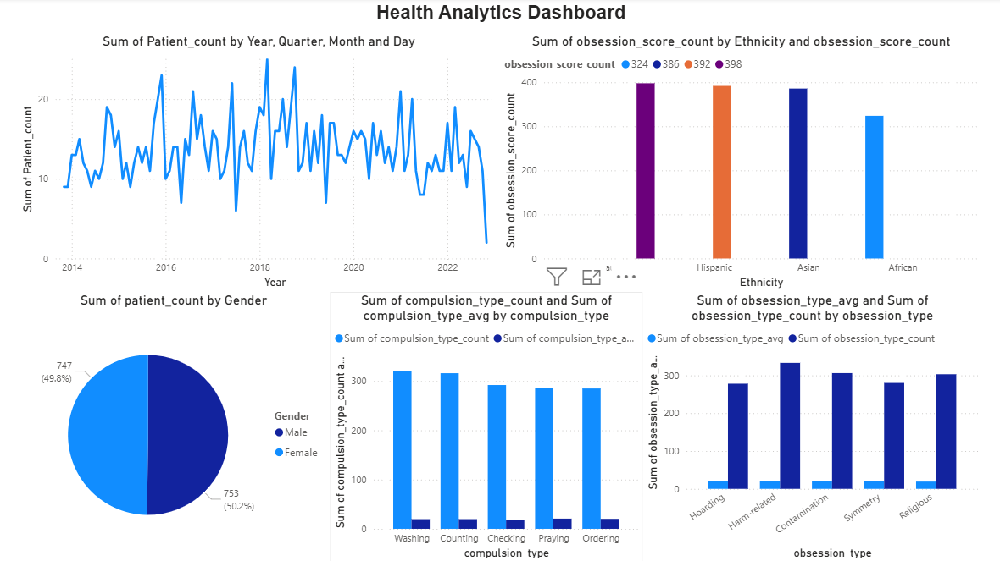

# OCD Patient Health Analytics Dashboard

An end-to-end health data analytics project analyzing demographic and clinical data of 1,500 OCD patients using SQL, and Power BI.

---

## Dataset

**OCD Patient Dataset: Demographics & Clinical Data**  
Source: Kaggle  

A comprehensive dataset of 1,500 individuals diagnosed with Obsessive-Compulsive Disorder (OCD), covering:
- Demographic information: age, gender, ethnicity, marital status, education level
- Clinical data: diagnosis date, symptom duration, psychiatric history
- OCD-specific data: obsession and compulsion types, Y-BOCS severity scores
- Treatment data: medications prescribed, family history of OCD
- Co-occurring conditions: depression and anxiety diagnoses

---

## Tools Used

- **SQL** — Data extraction, cleaning, and preparation
- **Power BI** — Interactive dashboard and data visualization

---

## Dashboard Preview



---

## Key Findings

### Patient Trends
- Patient diagnoses peaked in **2018** with the highest recorded count, dropping significantly to just **2 patients in 2022**

### Demographics
- **Caucasian** patients recorded the highest OCD prevalence across all ethnic groups; **African** patients recorded the lowest
- Gender split is nearly even: **Men 50.2%** vs **Women 49.8%**, with men slightly more represented

### Obsession Types
| Obsession Type | Patient Count | Avg Y-BOCS Score |
|----------------|--------------|-----------------|
| Harm-related | 333 | 20.65 |
| Contamination | 306 | 19.67 |
| Religious | 303 | 19.23 |
| Symmetry | 280 | 19.67 |
| Hoarding | 278 | 21.01 |

> Hoarding obsessions carry the highest average severity score (21.01) despite the lowest patient count among the five types.

### Compulsion Types
| Compulsion Type | Patient Count | Avg Y-BOCS Score |
|----------------|--------------|-----------------|
| Washing | 321 | 19.63 |
| Counting | 316 | 19.66 |
| Checking | 292 | 17.92 |
| Praying | 286 | 20.73 |
| Ordering | 285 | 20.23 |

> Checking compulsions show the lowest average severity score (17.92), while Praying compulsions show the highest (20.73).

---

## Project Structure

```
ocd-health-analytics/
├── queries.sql        # SQL used for data cleaning and extraction
├── dashboard.png      # Power BI dashboard screenshot
└── README.md          
```

---

## Author

**Halima Ahmed Mohamed**  
BSc Software Engineering - Murang'a University of Technology  
ALX Data Science Program  
[LinkedIn](https://www.linkedin.com/in/halima-mohamed-5b8210365)
